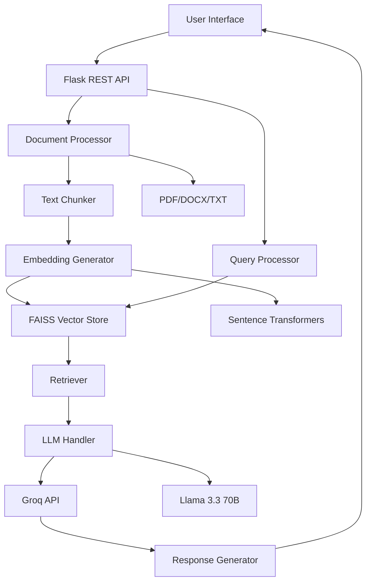
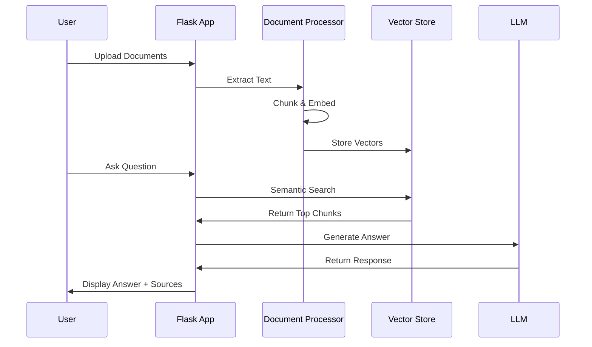

# 📚 LegalRAG - AI-Powered Legal Document Assistant

<div align="center">


**Transform how legal professionals interact with documents using AI-powered Retrieval-Augmented Generation**

[Demo](#-demo) • [Features](#-features) • [Installation](#-installation) • [Architecture](#-architecture)

</div>

## 📸 Demo


*LegalRAG in action - querying legal documents with AI-powered responses and source citations*

## 🎯 The Problem

Legal professionals face significant challenges in document management:

- ⏳ **Time Inefficiency**: 30-40% of time spent searching documents
- 📚 **Information Overload**: Thousands of pages of contracts and case files
- 💰 **High Costs**: Manual review costs $100-300 per hour
- ❌ **Human Error**: Critical information missed in large document sets

## 💡 The Solution

**LegalRAG** leverages Retrieval-Augmented Generation (RAG) to transform legal document analysis:

- ✅ **Instant Answers**: Query thousands of documents in seconds
- ✅ **Source Citations**: Every answer includes exact document references
- ✅ **Semantic Search**: Understands legal context, not just keywords
- ✅ **Cost Effective**: Reduces document review time by 70%+

## 🏗️ System Architecture



## 🔄 RAG Workflow



## 🚀 Quick Start

### Prerequisites
- Python 3.8+
- Groq API Key (free at [console.groq.com](https://console.groq.com))

### Installation

```bash
# Clone repository
git clone https://github.com/Akash-47-tank/LegalRAG-AI-Powered-Legal-Document-Assistant.git
cd legalrag

# Create virtual environment
python3 -m venv venv
source venv/bin/activate  # Windows: venv\Scripts\activate

# Install dependencies
pip install -r requirements.txt

# Configure environment
cp .env.example .env
# Edit .env and add your GROQ_API_KEY
```

### Run Application

```bash
python app.py
```
Visit `http://localhost:5000` to access the application.

## 🎯 Usage

1. **Upload Documents** - Drag & drop PDF, DOCX, or TXT files
2. **Index Documents** - Click "Index Documents" to process
3. **Ask Questions** - Type natural language queries
4. **Get Answers** - Receive AI-generated responses with source citations

### Example Queries
- "What are the termination clauses?"
- "Summarize the payment terms"
- "Find all intellectual property mentions"
- "What obligations does the vendor have?"

## 🛠️ Technology Stack

| Component | Technology |
|-----------|------------|
| **Frontend** | HTML5, CSS3, JavaScript |
| **Backend** | Flask 3.0 |
| **Vector DB** | FAISS |
| **Embeddings** | Sentence Transformers |
| **LLM** | Groq + Llama 3.3 70B |
| **Document Processing** | PyPDF2, python-docx |

## 📊 Performance

| Operation | Speed |
|-----------|-------|
| Document Upload | ~500ms/file |
| Text Extraction | 1-2s/50 pages |
| Embedding Generation | 2-3s/100 chunks |
| Query Response | 3-5s end-to-end |

## 🔧 Configuration

Key settings in `config.py`:

```python
CHUNK_SIZE = 1000           # Characters per chunk
CHUNK_OVERLAP = 200         # Overlap between chunks
TOP_K_DOCUMENTS = 4         # Chunks to retrieve
SIMILARITY_THRESHOLD = 0.5  # Minimum similarity score
```

## 📁 Project Structure

```
legalrag/
├── app.py                 # Main application
├── config.py             # Configuration
├── requirements.txt      # Dependencies
├── modules/             # Core modules
│   ├── document_processor.py
│   ├── embeddings.py
│   ├── vector_store.py
│   ├── retriever.py
│   └── llm_handler.py
├── static/              # Frontend assets
├── templates/           # HTML templates
├── uploads/            # Document storage
└── data/               # Vector store
```

## 🤝 Contributing

We welcome contributions! Please feel free to submit pull requests or open issues for bugs and feature requests.

## 👤 Author

**Akash Tank**  
- 💼 [LinkedIn](https://www.linkedin.com/in/aakashtank/)
- 🐙 [GitHub](https://github.com/Akash-47-tank)
- 📧 akashtank47@gmail.com

---

<div align="center">

**Built with ❤️ for the Legal Tech Community**

*Making legal document analysis accessible, efficient, and intelligent*

[⬆ Back to Top](#-legalrag---ai-powered-legal-document-assistant)

</div>
